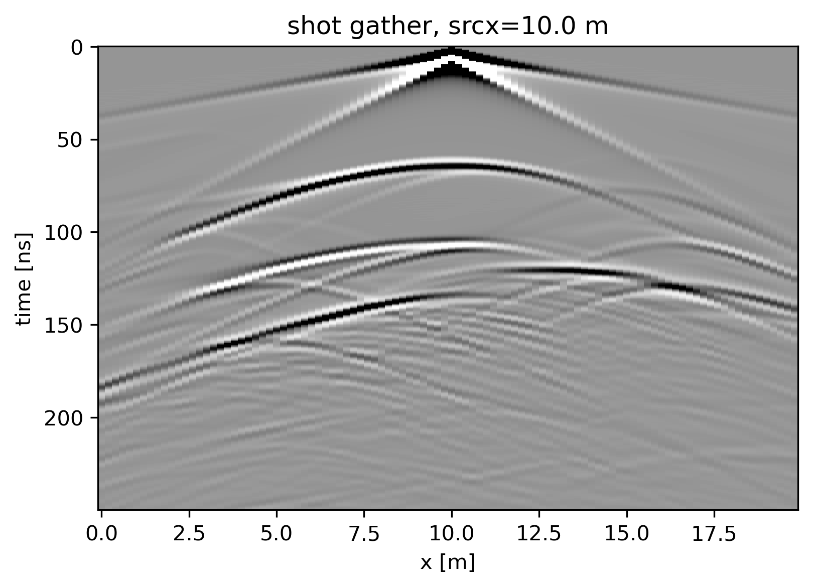

# 2D Ground Penetrating Radar Simulation

Andrew Hoffmann (@hoffmaao) converted the 2D radar simulation Matlab code from [this paper](https://doi.org/10.1016/j.cageo.2005.11.006) to Python. I've forked it to customize visualizations and tinker for my own purposes.

### Some of my goals are to:
* reproduce the figures from the paper
* compute shots in parallel
* make better animations / output of data cubes
* make an interactive earth model creator
* make a programmatic earth model creator

### Shot gather

### Common offset gather (radar profile)

### Wavefield animation

### Shot gather animation

